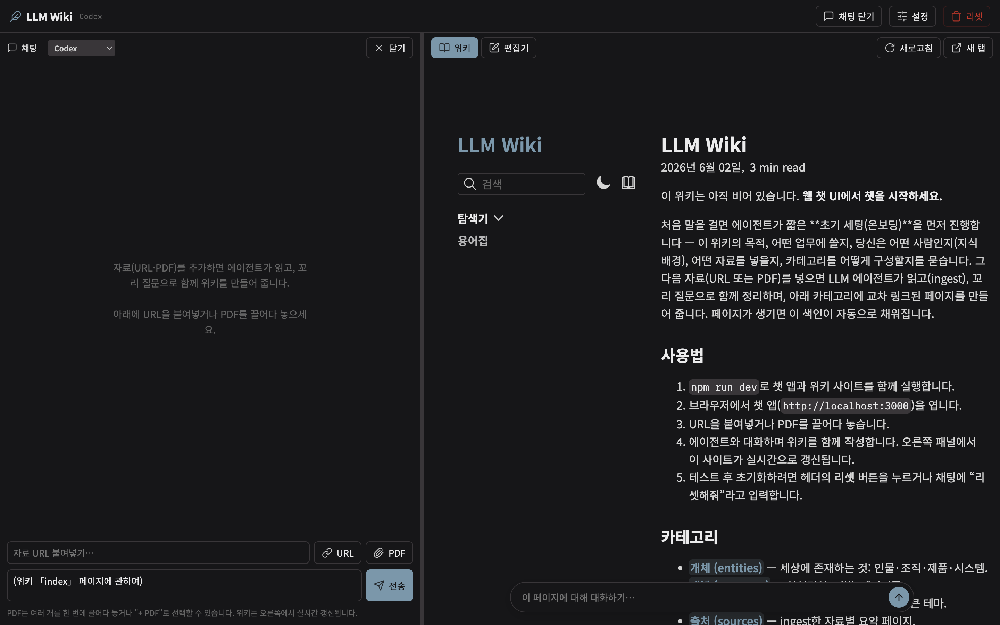
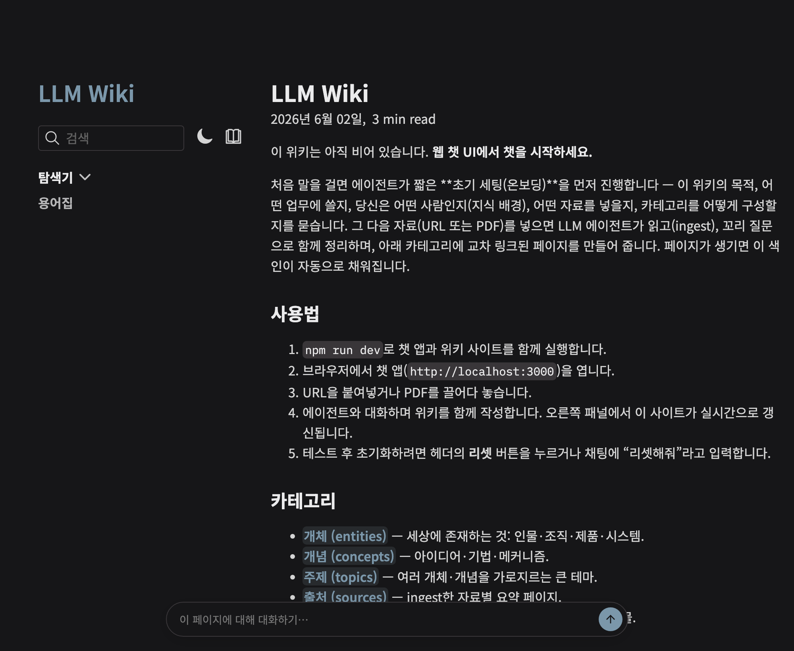

# LLM Wiki (웹 챗 + Quartz)

웹 채팅 UI에서 자료(URL·PDF)를 넣으면, LLM 에이전트가 읽고(ingest) 꼬리 질문으로
**함께 위키를 확장**하기 위한 도구. 생성된 마크다운은 [Quartz](https://quartz.jzhao.xyz/)로
실시간 렌더링된다. [`llm-wiki`](https://gist.github.com/karpathy/442a6bf555914893e9891c11519de94f)의
대화형 위키 구축 패턴을 Claude CLI가 아닌 **웹 채팅**(또는 `claude`/`antigravity` CLI)에서 수행한다.



---

# 1부 · 사람을 위한 가이드

## 0. 사전 준비 (Prerequisites)

| 도구 | 최소 버전 | 용도 | 확인 |
| --- | --- | --- | --- |
| **Node.js** | **≥ 22** | Quartz v4 + 챗 앱 런타임 | `node -v` |
| **npm** | **≥ 10.9.2** | 패키지 매니저 | `npm -v` |
| **git** | 임의 | 버전 관리 | `git --version` |
| **GitHub CLI** (`gh`) | 임의 | 레포 클론/생성/푸시 | `gh --version` |
| **Claude Code** (`claude`) | 최신 | 기본 LLM 프로바이더(구독 재사용) | `claude --version` |
| **Antigravity** (`antigravity`/`agy`) | 최신 | 대체 프로바이더(선택) | `agy --version` |
| Cloudflare 계정 | — | 공개 배포(선택) | — |

### 0.1 macOS — 핵심 패키지 한 번에

```bash
brew install node@22 git gh

# node@22는 keg-only(자동으로 PATH에 안 올라감) → PATH 선두에 등록
echo 'export PATH="/opt/homebrew/opt/node@22/bin:$PATH"' >> ~/.zshrc
exec zsh

node -v   # v22.x 이어야 함
npm -v    # 10.9.2 이상
```

> Linux는 [nodejs.org](https://nodejs.org) LTS(≥22) 또는 `nvm install 22`, `gh`는
> 패키지 매니저로 설치한다.

### 0.2 GitHub 인증 (`gh`)

```bash
gh auth login        # GitHub.com → HTTPS → 브라우저로 인증
gh auth status       # 로그인/스코프 확인
```

- 필요한 토큰 스코프: **`repo`**, **`workflow`** (조직 사용 시 `read:org` 권장).
- 이후 `git push`/`gh repo` 가 별도 자격증명 없이 동작한다.

### 0.3 Claude Code 설정 — 기본 프로바이더 (API 키 불필요)

```bash
npm install -g @anthropic-ai/claude-code   # claude CLI 설치
claude                                      # 최초 1회: 브라우저 로그인(구독 계정)
command -v claude && claude --version        # 설치 확인
```

- **구독 세션을 그대로 재사용** → 별도 API 키 과금 없음. 자격증명은 `~/.claude`에 저장.
- 레포 루트의 `CLAUDE.md`와 `.claude/skills/`(onboard·ingest·query·lint·reset)를
  자동 로드한다.

### 0.4 Antigravity CLI 설정 — 대체 프로바이더 (선택)

- Antigravity(IDE/CLI)를 공식 배포처에서 설치한다. 설치 후 GUI 연동용 `antigravity`와
  **헤드리스용 `agy`**가 PATH에 있어야 한다(기본 위치 예: `~/.antigravity/antigravity/bin`).

```bash
echo 'export PATH="$HOME/.antigravity/antigravity/bin:$PATH"' >> ~/.zshrc
exec zsh
command -v antigravity agy     # 둘 다 잡혀야 함
```

- 인증: Gemini를 쓰려면 Google 계정 / Gemini API 키가 필요하다. **키가 없으면 이
  레포는 자동으로 Claude Code 세션을 폴백**으로 사용한다(아래 [프로바이더](#3-llm-프로바이더) 참고).
- 백엔드 연동은 헤드리스(`agy`)로 동작하므로 IDE 창을 띄우지 않는다(트러블슈팅 1 참고).

## 1. 레포 가져오기 & 실행 (Quick start)

```bash
# 1) 기존 레포 클론 (gh 인증 후)
gh repo clone JaeoneLim/llm-wiki-web
cd llm-wiki-web

# 2) 의존성 설치 (루트 Quartz + app)
npm install               # 루트(Quartz)
npm --prefix app install  # 챗 앱(server + web)

# 3) 개발 모드 (3개 프로세스 동시 실행)
npm run dev
```

- **웹 챗 UI** → http://localhost:3000 ← 여기를 연다
- **위키(Quartz)** → http://localhost:8080 ← 챗 UI 오른쪽 패널에 임베드됨
- 챗 백엔드 API → http://localhost:3001 (`/`는 404가 정상 — API 전용)

### CLI 환경에서 사용하기 (웹 UI 없이)

```bash
# Claude Code
claude "raw/uploads/some-file.pdf 를 ingest 스킬대로 정리해줘"

# Antigravity (헤드리스)
agy "새 자료 https://example.com/post 를 ingest 해줘"
antigravity chat          # 대화형 모드
```

레포 루트에서 실행하면 `CLAUDE.md`/`ANTIGRAVITY.md`와 스킬을 자동 인식한다.

## 2. 사용법

- **자료 추가**: 채팅에 URL 붙여넣기 / PDF 드롭(여러 개 가능) → 에이전트가 ingest.
- **빈 위키 첫 실행**: 에이전트가 **온보딩 인터뷰**(위키 목적·대상 업무·사용자 배경·
  넣을 자료·카테고리)를 먼저 진행한 뒤 자료를 받는다.
- **패널 너비 조절**: 채팅↔위키 경계의 분할선을 **드래그**해 좌우 비율을 바꾼다(저장됨).
- **직접 편집**: 오른쪽 **편집기** 탭에서 페이지를 열어 수정·저장(⌘S). Quartz 핫리로드.
- **리셋**: 헤더 **리셋** 버튼 / 채팅에 "리셋해줘" / CLI `npm run reset`.
  - 지워짐: `wiki/**`, `raw/clips/**`, `raw/uploads/**`.
  - 복원: `index.md`·`log.md`·`glossary.md`(← `seed/` 기준). `.gitkeep` 보존.



## 3. LLM 프로바이더

헤더의 **설정**에서 고른다. (CLI/IDE 환경에서는 `claude` 또는 `antigravity`/`agy`.)

| 프로바이더 / 환경 | 인증 / 구동 방식 | 비고 |
| --- | --- | --- |
| **Claude Code (기본)** | 로컬 구독 계정 재사용 | 별도 API 키 불필요. `~/.claude` 로그인. `CLAUDE.md`·스킬 자동 로드 |
| **Antigravity CLI** | 로컬 IDE / CLI | `antigravity chat`·`agy`로 구동. `ANTIGRAVITY.md`·스킬 자동 로드 |
| **Codex** | API 키 | OpenAI/Codex 호환 API. 전용 **Codex CLI 연동은 추후 추가 예정** |

- 기본값 **Claude Code**는 로컬 `claude` CLI의 구독 자격증명을 그대로 쓴다(과금 없음).
  레포의 `CLAUDE.md`와 `.claude/skills/`(onboard·ingest·query·lint·reset)를 자동으로 따른다.
- **Antigravity** 환경은 `ANTIGRAVITY.md`와 `.antigravity/skills/`를 읽어 동작한다.
  Gemini 키가 비어 있으면 Claude Code 세션을 폴백으로 사용한다.
- 다른 프로바이더 키는 `app/config.json`에 로컬 저장되며 **gitignore** 된다(UI 전송 시 마스킹).

## 4. 로그인 / 접근 제어 (선택)

챗 앱을 단일 비밀번호로 잠글 수 있다. 기본은 **꺼짐**(로컬 개발 무마찰).

- **설정 패널 → "앱 로그인 비밀번호"** 로 지정 → 다음 접속부터 로그인 화면.
- 또는 환경변수 **`WIKI_PASSWORD`**(배포 권장, UI에서 변경 불가).
- 세션은 서명된 httpOnly 쿠키. 고정 세션을 원하면 **`SESSION_SECRET`** 환경변수를 둔다
  (없으면 자동 생성해 `app/config.json`에 저장).

이 로그인은 **챗 앱(:3000)과 API만** 보호한다. 읽기 전용 위키 사이트(:8080)는 배포 시
Cloudflare Access(이메일 PIN)로 별도 보호 → [`DEPLOY.md`](./DEPLOY.md).

## 5. 빌드 / 배포 (Deployment)

```bash
npm run build   # 정적 사이트 생성 → public/ (Quartz)
npm run serve   # 프로덕션: 단일 포트로 / + /api + /wiki 동시 서빙 (협업자 배포용)
```

### A. 읽기전용 공개 위키 → Cloudflare Pages (요약, 전체는 [`DEPLOY.md`](./DEPLOY.md))

1. private GitHub 레포에 push. 배포 전 `quartz.config.ts`의 `baseUrl`을 실제 도메인으로.
2. Cloudflare **Workers & Pages → Create → Pages → Connect to Git** → 이 레포 선택.
3. **Build command** `npm install && npm run build` · **Output** `public` · **Root** `/`.
4. **환경변수** `NODE_VERSION=22` (필수 — Quartz는 Node ≥22).
5. **Zero Trust → Access → Applications**에서 One-time PIN(이메일 화이트리스트)으로 잠금.
6. 이후 `git push origin main` 마다 자동 빌드·배포.

> 챗·ingest 백엔드는 파일시스템·`claude` 바이너리·키가 필요하므로 **절대 공개 배포하지
> 않는다**. 공개되는 것은 `public/` 정적 결과뿐이다.

### B. 협업자가 챗으로 위키를 구축하게 열어주기 → [`COLLABORATE.md`](./COLLABORATE.md)

`npm run serve`(내 머신, 단일 오리진) + Cloudflare Tunnel + Access. 내 Claude Code
구독이 백엔드를 구동한다.

## 6. 트러블슈팅

- **`node: command not found` / npm 버전 낮음**: `brew install node@22` 후 keg-only
  PATH 등록(§0.1). `node -v`가 v22, `npm -v` ≥ 10.9.2인지 확인.
- **:8080 충돌(EADDRINUSE)**: 다른 Quartz/프로세스가 8080을 점유 중. 해당 프로세스를
  종료하거나 포트를 비우고 `npm run dev` 재시작.
- **Cloudflare 빌드가 Node 18로 시도**: Pages 환경변수 `NODE_VERSION=22` 확인.
- **Antigravity 작동 중 IDE 창이 켜짐**: GUI 명령(`antigravity chat`)을 직접 띄우면
  에디터가 포커스된다. 백엔드 연동은 헤드리스라 창을 열지 않는다. 터미널에서 직접
  작업하려면 헤드리스 `agy`를 쓴다. `--dangerously-skip-permissions`는 백엔드·스크립트에
  **절대 사용 금지**(승인 단계를 건너뛰어 위험).
- **Antigravity 프로바이더 인증**: 설정에 Gemini 키가 있으면 Gemini로 구동, 비어 있으면
  로컬 Claude Code 구독 세션을 폴백으로 삼아 `ANTIGRAVITY.md` 규약대로 동작(키 없이도 가능).

## 7. 추후 업데이트 예정 (Roadmap)

- **그래프 뷰 (graph view)** — Quartz 기본 지식 그래프가 우측 패널에 있다. 페이지가
  충분히 쌓인 뒤 전역 그래프 구성·필터·클러스터링(태그/카테고리 기준) 다듬기는 추후 예정.
- **Codex CLI 연동** — Claude Code·Antigravity CLI처럼 OpenAI Codex CLI를 구독형
  프로바이더로 추가 예정.
- **PROD 자동 새로고침 보강** — 정적 배포(`/wiki`)에서 서버 리빌드 완료 신호 기반으로
  위키 패널을 정확히 한 번 갱신(현재 dev는 Quartz 라이브리로드로 처리).

## 메모 / 보안

- Claude Code 경로는 로컬에서 `bypassPermissions`로 자율 실행된다. **본인 머신에서
  본인 레포 대상으로만** 쓰는 로컬 도구다. 공개 노출 금지.
- AI SDK 경로의 대화 히스토리는 인메모리(재시작 시 소실). Claude 경로는 `~/.claude`
  세션으로 resume.

---

# 2부 · 에이전트를 위한 런북 (Agent Runbook)

> AI 에이전트가 이 레포를 **셋업·실행·배포·운영**할 때 따르는 결정적 절차.
> 설명문이 아니라 그대로 실행 가능한 단계로 쓴다. 사람의 인증/승인이 필요한 단계는
> 사용자에게 위임한다(에이전트가 대신 로그인하지 않는다).

## R0. 환경 부트스트랩

```bash
# Node ≥22 (keg-only PATH 선두)
command -v node || brew install node@22
export PATH="/opt/homebrew/opt/node@22/bin:$PATH"
node -v   # v22.x   |   npm -v  # ≥10.9.2

# git / gh
command -v gh || brew install gh
gh auth status    # 실패하면 사용자에게 `! gh auth login` 요청(대화형 로그인은 사람이)

# 프로바이더(택1 이상)
command -v claude            # 기본. 없으면: npm i -g @anthropic-ai/claude-code → 사용자가 `claude` 로그인
command -v antigravity agy   # Antigravity 경로일 때
```

규칙: **대화형 로그인(`gh auth login`, `claude` 브라우저 인증, Cloudflare 로그인)은
에이전트가 수행하지 않는다.** 누락 시 사용자에게 `! <command>` 실행을 요청한다.

## R1. 레포 준비

```bash
gh repo clone <owner>/llm-wiki-web   # 이미 있으면 생략
cd llm-wiki-web
npm install && npm --prefix app install
```

## R2. 실행 (백그라운드 + 헬스체크)

```bash
# PATH에 node@22를 선두로 두고 백그라운드 실행
npm run dev   # quartz(:8080) + server(:3001) + web(:3000)
```

- 헬스체크: `:3000`·`:8080` → HTTP 200, `:3001` → listening(`/`는 404가 정상).
- `tsx watch`가 server `.ts`를 핫리로드한다(서버 편집 후 별도 재시작 불필요).

## R3. 위키 운영 규칙

- 매 세션 `CLAUDE.md`(Antigravity면 `ANTIGRAVITY.md`)와 해당 `*/skills/`를 따른다.
- **빈 위키**(= `wiki/`에 콘텐츠 없음 + `wiki/notes/about-this-wiki.md` 없음)면
  자료 ingest 전에 **`onboard`** 스킬로 초기 세팅 인터뷰(목적·업무·사용자·자료·카테고리).
- 연산: `onboard` · `ingest` · `query` · `lint` · `reset`(스킬 우선 로드).
- 레이어: `raw/**`는 **불변**(읽기만), `wiki/**`는 작업면, `index.md`/`log.md`/`glossary.md`는
  **레포 루트**(절대 `wiki/index.md` 생성 금지).
- ingest는 파일 쓰기 전에 핵심을 논의·꼬리질문 → 연산을 번호로 제안 → 사용자 확인 후 실행.

## R4. 배포 (요약)

1. private 레포 push. `quartz.config.ts`의 `baseUrl`을 실제 도메인으로 갱신.
2. Cloudflare Pages: Build `npm install && npm run build`, Output `public`, Env `NODE_VERSION=22`.
3. Cloudflare Access(One-time PIN, 이메일 화이트리스트)로 잠금.
4. **Cloudflare 콘솔 로그인·DNS·Access 설정은 사용자에게 위임.** 전체 절차는 `DEPLOY.md`.

## R5. 가드레일 (반드시 지킴)

- Claude `bypassPermissions`는 **로컬 전용**. 챗·ingest 백엔드를 공개 노출하지 않는다.
- `reset` 등 **파괴적 동작**과 **외부 전송/배포**는 사용자 명시 확인 후에만.
- **커밋·푸시는 사용자가 요청할 때만**. `main` 직접 푸시 지양 → 기능 브랜치.
- 비밀(API 키·비밀번호 해시·세션 시크릿)은 `app/config.json`(gitignore). 출력/커밋에 노출 금지.
- `--dangerously-skip-permissions` / `agy --dangerously-*` 류는 백엔드·스크립트에 사용 금지.
